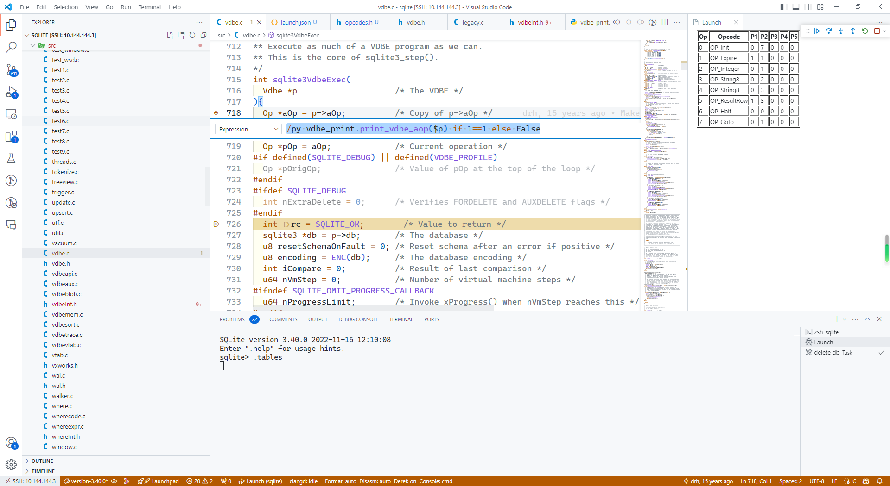

在最近分析 SQLITE3 的源码的时候，发现查询 SQLITE3 VDBE 虚拟机的执行指令很不方便，指令都是定义的类似如下的宏

```c
#define OP_Savepoint       0
#define OP_AutoCommit      1
#define OP_Transaction     2
#define OP_Checkpoint      3
#define OP_JournalMode     4
...
```
那么在调试的过程中，指令的名字只是一个数字，对于理解指令集很麻烦，只能去 `opcodes.h` 中进行查询，不是很方便。


记得在原来查看 codelldb 的介绍页面的时候，看到了一个很酷炫的图就是用 python 来读取数据进行绘制。于是我就想可以用 python 
来进行转换。查询了一些资料终于实现了一下版本：

```python
#!/usr/bin/env python3
import lldb
import debugger

opcode_map = {
    0:"OP_Savepoint",
    1:"OP_AutoCommit",
    2:"OP_Transaction",
    3:"OP_Checkpoint",
    4:"OP_JournalMode"
    ...
}

def print_vdbe_aop(addr):
    print("print_vdbe_aop")
    """Command to print the contents of the aOp array in a Vdbe struct"""
    addr = debugger.unwrap(addr)
    vdbe_ptr = 0
    if addr.TypeIsPointerType():
        vdbe_ptr = addr.GetValueAsUnsigned()
    else:
        vdbe_ptr = addr.AddressOf().GetValueAsUnsigned()

    # 获取 aOp 和 nOp
    aop_expr = f"((Vdbe*){vdbe_ptr})->aOp"
    nop_expr = f"((Vdbe*){vdbe_ptr})->nOp"

    aOp = lldb.frame.EvaluateExpression(aop_expr)  # 获取 aOp 数组的指针
    nOp = lldb.frame.EvaluateExpression(nop_expr)  # 获取 nOp 数量

    if aOp.IsValid() and nOp.IsValid():
        # 获取 aOp 数组的长度
        nOp_val = nOp.GetValueAsSigned()
        table = "<table border=1><tr><th>Op</th><th>Opcode</th><th>P1</th><th>P2</th><th>P3</th><th>P4</th><th>P5</th></tr>"
        print(f"Number of operations (nOp): {nOp_val}")
        for i in range(nOp_val):
            # 读取每个 Op 的 opcode 值
            op_expr = f"((Op*)({aOp.GetValue()} + sizeof(Op) * {i}))->opcode"
            opcode = lldb.frame.EvaluateExpression(op_expr).GetValueAsUnsigned()

            # 获取 P1, P2, P3, P4, P5 参数
            p1_expr = f"((Op*)({aOp.GetValue()} + sizeof(Op) * {i}))->p1"
            p2_expr = f"((Op*)({aOp.GetValue()} + sizeof(Op) * {i}))->p2"
            p3_expr = f"((Op*)({aOp.GetValue()} + sizeof(Op) * {i}))->p3"
            p4_expr = f"((Op*)({aOp.GetValue()} + sizeof(Op) * {i}))->p3"
            p5_expr = f"((Op*)({aOp.GetValue()} + sizeof(Op) * {i}))->p3"


            p1 = lldb.frame.EvaluateExpression(p1_expr).GetValueAsSigned()
            p2 = lldb.frame.EvaluateExpression(p2_expr).GetValueAsSigned()
            p3 = lldb.frame.EvaluateExpression(p3_expr).GetValueAsSigned()
            p4 = lldb.frame.EvaluateExpression(p4_expr).GetValueAsSigned()
            p5 = lldb.frame.EvaluateExpression(p5_expr).GetValueAsSigned()

            # 将 opcode 转换为字符串
            opcode_name = opcode_map.get(opcode, f"Unknown Opcode ({opcode})")

            print(f"Op[{i}]: {opcode_name} (P1: {p1}, P2: {p2}, P3: {p3}, P4: {p4}, P5: {p5})")

            # create a html table
            #
            table += f"<tr><td>{i}</td><td>{opcode_name}</td><td>{p1}</td><td>{p2}</td><td>{p3}</td><td>{p4}</td><td>{p5}</td> </tr>"
        
        table += "</table>"
        debugger.display_html(table,position=2)

    else:
        print("Failed to retrieve aOp or nOp")
```

这里可以参考 codelldb 的 (README)[https://github.com/vadimcn/codelldb/blob/master/MANUAL.md#debugger-api] 文档,其中实现了对部分 lldb python 接口的包装.

代码的主要思路就是获取变量的地址,然后执行表达式,最后将结果使用 html 进行输出,这样就可以在 vscode 中直接查看结果了.

具体的操作方式:

1. 加载 python 文件

    在 vscode 的 `launch.json` 中加入如下内容,加载 python 脚本
    ```json
        "initCommands": [
                "command script import ~/code/c/sqlite/vdbe_print.py"
            ],
    ```

2. 在 `sqlite3VdbeExec` 添加一个条件断点,内容如下:
    ```
      /py vdbe_print.print_vdbe_aop($p) if 1==1 else False
    ```
    这里的 p 是 Vdbe 变量.

3. 运行程序查看结果


截图如下:

