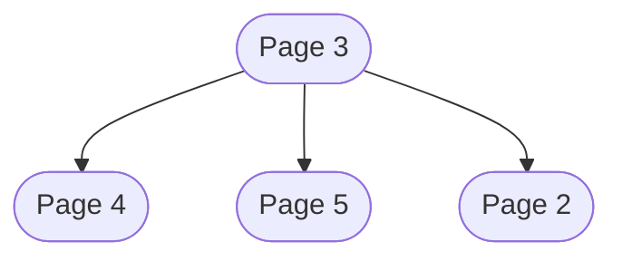

## 前记

这一篇我们将分析一下 SQlite3 的文件格式. 参考[链接](https://www.sqlite.org/fileformat.html).

我们需要用到一个[网站](https://torymur.github.io/sqlite-repr/),可以直观的展示 sqlite3 的格式,带有互动功能.

同时我们还可以使用 sqlite 自带的一个 `showdb` 的工具来查看 sqlite 的数据库的一些信息.

## 格式分析

sqlite3 的数据文件被分成了固定大小的页面，然后页面之间通过一个页编号来进行互相引用。

其中页面可以被分为：自由页面(即未被使用的页面)，B 树页面，溢出页面。其他页面暂不说明。

### 数据库头

| 偏移量(字节) | 大小(字节) | 描述                                                                                                 |
| ------------ | ---------- | ---------------------------------------------------------------------------------------------------- |
| 0-15         | 16         | 文件头字符串: "SQLite format 3\000"                                                                  |
| 16-17        | 2          | 页大小(默认 4096),同时页面大小必须为 2 的次幂数,且范围为 512-32768, 如果是 1 的话,则页面大小为 65536 |
| 18           | 1          | 写入格式版本(1 或 2)                                                                                 |
| 19           | 1          | 读取格式版本(1 或 2)                                                                                 |
| 20           | 1          | 每页末尾保留的字节数(通常为 0)                                                                       |
| 21           | 1          | 最大的嵌入负载的比例,必须为 64,这个指的是实际存储在页面中的数据的比例                                |
| 22           | 1          | 最小的嵌入负载比例,必须为 32,这个指的是实际存储在页面中的数据的比例                                  |
| 23           | 1          | 叶子页面负载比例,必须为 32                                                                           |
| 24           | 4          | 文件修改计数器,即这个数据文件被修改过多少次                                                          |
| 28           | 4          | 数据库大小(以页为单位)                                                                               |
| 32           | 4          | 第一个自由页面(空闲页面)的编号，我们可以理解为被删除的表所占用的页面                                 |
| 36           | 4          | 总的自由页面个数                                                                                     |
| 40           | 4          | schema cookie, 可以理解为用来记录数据库改动的一个参数，在前面我们创建表的时候就要读取这个参数        |
| 44           | 4          | schema 格式类型，目前只有1，2，3，4 这四种,可能随着 sqlite3 的更新还会变化                           |
| 48           | 4          | 默认页面缓存大小                                                                                     |
| 52           | 4          | 在 vacuum 模式下，最大 b 树根页面的页码，否则为 0                                                    |
| 56           | 4          | 数据库文本编码格式,1 表示 UTF-8,2 表示 UTF-16LE, 3 表示 UTF-16BE                                     |
| 60           | 4          | 一个可供用户修改的格式信心,可以使用 `PRAGMA schema.user_version = integer ;` 来修改                  |
| 64           | 4          | 如果不为 0 则表示 incremental-vacuum 模式,否则为 0                                                   |
| 68           | 4          | 应用程序 ID, 一般可用于 file 命令来读取,当然也可以使用 `PRAGMA` 命令来修改适用于用户自己的文件类型   |
| 72           | 20         | 用于扩展,必须为 0                                                                                    |
| 92           | 4          | 版本有效数字                                                                                         |
| 96           | 4          | 最新修改数据文件的SQLite版本号                                                                       |

我们可以在如下的网站中查看具体的信息:


我们也可以使用 `showdb` 命令来查看数据库头信息:

```bash
./showdb ./test.db dbheader
Pagesize: 4096
Available pages: 1..2
 000: 53 51 4c 69 74 65 20 66 6f 72 6d 61 74 20 33 00 SQLite format 3.
 010: 10 00 01 01 00 40 20 20 00 00 00 01 00 00 00 02 .....@  ........
 014: 00                     0  Reserved space at end of page
 018: 00 00 00 01            1  File change counter
 01c: 00 00 00 02            2  Size of database in pages
 020: 00 00 00 00            0  Page number of first freelist page
 024: 00 00 00 00            0  Number of freelist pages
 028: 00 00 00 01            1  Schema cookie
 02c: 00 00 00 04            4  Schema format version
 030: 00 00 00 00            0  Default page cache size
 034: 00 00 00 00            0  Largest auto-vac root page
 038: 00 00 00 01            1  Text encoding
 03c: 00 00 00 00            0  User version
 040: 00 00 00 00            0  Incremental-vacuum mode
 044: 00 00 00 00            0  Application ID
 048: 00 00 00 00            0  meta[8]
 04c: 00 00 00 00            0  meta[9]
 050: 00 00 00 00            0  meta[10]
 054: 00 00 00 00            0  meta[11]
 058: 00 00 00 00            0  meta[12]
 05c: 00 00 00 01            1  Change counter for version number
 060: 00 2e 63 00      3040000  SQLite version number
```

### 空闲页面

数据库文件可能包含一个或多个未使用的页面,例如,当信息从数据库删除时,就是出现未使用的页面.未使用的页面存储在空闲列表中,当需要使用额外页面的
时候,这些页面将重新被使用.

第一个空闲页面的编号存储在数据库头文件偏移量为 32 的地方,总的空闲页面数量存储在偏移量为 36 的这个地方.

空闲页面的方式以链表的形式进行组织.每个空闲页面包含 0 个或多个空闲页面的页码.

空闲页面由一个四字节大端序整数数组组成,其中第一个 4 字节是下一个空闲页面的页面,如果这是最后一个空闲页面,则数组第一个值为 0,
第二个 4 字节是当前空闲页面记录的空闲页面的个数,后续的 4 字节数也是空闲页面的页码.

我们可以查看当前网站来分析空闲页面的组织方式:


同时我们也可以使用 `showdb` 来查看空闲页面的信息,我们可以使用如下语句来生成多个空闲页面

```sql
create table test(id int);
WITH RECURSIVE
  numbers(value) AS (
    SELECT 1
    UNION ALL
    SELECT value + 1 FROM numbers
    LIMIT 1000
  )
INSERT INTO test (id)
SELECT value FROM numbers;
drop table test;
```

1. 查看第一个空闲页面的页码以及数量

```bash
./showdb ./test.db dbheader
Pagesize: 4096
Available pages: 1..5
 000: 53 51 4c 69 74 65 20 66 6f 72 6d 61 74 20 33 00 SQLite format 3.
 010: 10 00 01 01 00 40 20 20 00 00 00 03 00 00 00 05 .....@  ........
 020: 00 00 00 03 00 00 00 04 00 00 00 02 00 00 00 04 ................
 030: 00 00 00 00 00 00 00 00 00 00 00 01 00 00 00 00 ................
 050: 00 00 00 00 00 00 00 00 00 00 00 00 00 00 00 03 ................
 060: 00 2e 63 00 00                                  ..c..
```

我们可以看到偏移量为 32(0x20) 处的数字为 3, 偏移量为 36(0x24) 的数字为 4.说明第一个空闲页面的编码为 3, 总的空闲页面个数为 4.

2.查看空闲页面的编码

```bash
./showdb ./test.db 3td
Pagesize: 4096
Available pages: 1..5
Decode of freelist trunk page 3:
 000: 00 00 00 00            0  Next freelist trunk page
 004: 00 00 00 03            3  Number of entries on this page
    [0]       4    [1]       5    [2]       2
```

我们可以看到在页面 3 上,下一个空闲页码为 0 ,说明没有其他空闲页面,当前页面上包含3 个空闲页面的页码,他们分别为 4,5,2.

所以总共的空闲页面为3,4,5,2



### B 树页面

关于 B 树的组织形式,我们可以查看这个[链接](https://www.cs.usfca.edu/~galles/visualization/BPlusTree.html) 来进行插入和删除操作
对B 树有一个直观的了解,在内部节点中只有用于查找的关键字实际的数据存储在叶子节点中.

B 树页面按以下顺序划分为若干区域:

1. 100 个字节的数据库头信息,这个只有在第一个页面才有
2. 如果为叶子页面由 8 个字节组成的页面头信息,如果为内部页面,则由 12 个字节组成的页面信息
3. 单元指针数组,指向数据库存储的具体信息
4. 未分配空间
5. 数据库具体存储的信息
6. 保留区域

保留区域是每页末尾未使用的空间,扩展应用程序可以用于保存每页信息,保留区域的大小由数据库头信息偏移处 20 的字节决定,一般为 0.

页面头信息如下

| 偏移量(字节) | 大小(字节) | 描述                                                                                                   |
| ------------ | ---------- | ------------------------------------------------------------------------------------------------------ |
| 0            | 1          | 用于描述页面的类型,0x02 表示索引内部页面,0x05 表示表内部页面,0x0a 表示索引叶子页面,0x0d 表示表叶子页面 |
| 1            | 2          | 表示当前页面第一个可用块的位置,如果没有可用块,则为 0                                                   |
| 3            | 2          | 表示当前页面包含多少个内容单元                                                                         |
| 5            | 2          | 表示当前页面内容区域的开始位置,如果是 0 的话,则表示为 65536                                            |
| 7            | 1          | 单元格内容区域内的碎片空闲字节数                                                                       |
| 8            | 4          | 当前内部页面最右边指针指向的页码                                                                       |

如果一个页面不包含单元格(一般出现在一个数据表的根页面且没有任何数据),那么单元格内容区域的偏移量就等于页面大小减去保留空间的字节树.如果数据
库使用的页面大小为 65536,且保留字节为 0,那么这个单元格内容区域的偏移量就是 65536,然而这个放不进 2 个字节内,所以用 0 来表示,这个我们后边会进行说明.

B 树页面上的可用空间总量由未分配区域的大小、所有可用块的总大小以及碎片可用字节数组成。SQLite可能会不时重组 B 树页面,以消除可用块或碎片字节,将所有未使用的字节都包含在未分配空间区域中,并将所有单元格紧密地打包在页面末尾。这被称为"碎片整理" B 树页面.

我们在 B 树的页面上存储来内容单元格,那么这些内容单元格是以什么样的形式存储到页面上的呢?

- 数据表叶子页面(0X0D)

- 数据表内部页面(0X05)

- 索引叶子页面(0x0A)

- 索引内部页面(0x02)

SQLite3 的 B 树页面分为四个类型,即数据表内部页面,数据表叶子页面,索引内部页面,索引叶子页面.这里我们对表内部页面和表叶子页面做一个说明.

#### 表内部页面

#### 表叶子页面

### 溢出页面

### Varint 数据类型

## 后记

终于理解了 sqlite3 的数据格式了.😎
