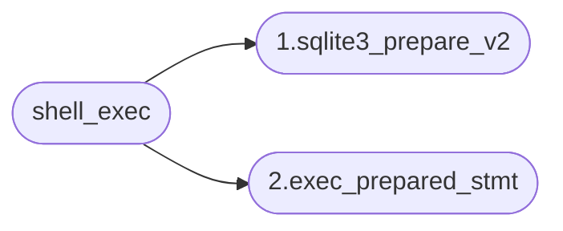

## 前记



函数调用图:
1. shell_exec 先调用 `sqlite3_prepare_v3` 生成 VDBE 虚拟指令
2. shell_Exec 后调用  `exec_prepared_stmt` 来执行  VDBE 虚拟指令

在这一篇中我们将来看一下数据表的创建，这里我们暂不说明底层数据的存储。只说明 VDBE 相关内容。这里我们列出了 `CREATE TABLE test5(id int)` 的 VDBE 执行码。

```
addr  opcode         p1    p2    p3    p4             p5  comment
----  -------------  ----  ----  ----  -------------  --  -------------
0     Init           0     30    0                    0   Start at 30
1     ReadCookie     0     3     2                    0
2     If             3     5     0                    0
3     SetCookie      0     2     4                    0
4     SetCookie      0     5     1                    0
5     CreateBtree    0     2     1                    0   r[2]=root iDb=0 flags=1
6     OpenWrite      0     1     0     5              0   root=1 iDb=0
7     NewRowid       0     1     0                    0   r[1]=rowid
8     Blob           6     3     0                   0   r[3]= (len=6)
9     Insert         0     3     1                    8   intkey=r[1] data=r[3]
10    Close          0     0     0                    0
11    Close          0     0     0                    0
12    Null           0     4     5                    0   r[4..5]=NULL
13    Noop           2     0     4                    0
14    OpenWrite      1     1     0     5              0   root=1 iDb=0; sqlite_master
15    Explain        15    0     0     SEARCH main.sqlite_master USING INTEGER PRIMARY KEY (rowid=?)  0
16    ReleaseReg     11    1     0                    0   release r[11] mask 0
17    SeekRowid      1     19    1                    0   intkey=r[1]
18    Rowid          1     5     0                    0   r[5]= rowid of 1
19    IsNull         5     27    0                    0   if r[5]==NULL goto 27
20    String8        0     6     0     table          0   r[6]='table'
21    String8        0     7     0     test5          0   r[7]='test5'
22    String8        0     8     0     test5          0   r[8]='test5'
23    SCopy          2     9     0                    0   r[9]=r[2]
24    String8        0     10    0     CREATE TABLE test5(id int)  0   r[10]='CREATE TABLE test5(id int)'
25    MakeRecord     6     5     4     BBBDB          0   r[4]=mkrec(r[6..10])
26    Insert         1     4     5                    0   intkey=r[5] data=r[4]
27    SetCookie      0     1     5                    0
28    ParseSchema    0     0     0     tbl_name='test5' AND type!='trigger'  0
29    Halt           0     0     0                    0
30    Transaction    0     1     4     0              1   usesStmtJournal=1
31    TableLock      0     1     1     sqlite_master  0   iDb=0 root=1 write=1
32    Goto           0     1     0                    0
```

## 代码解析

首先,我们可以看一下 `parse.y` 中关于 `CREATE TABLE` 的相关解析:

``` 
cmd ::= create_table create_table_args.
create_table ::= createkw temp(T) TABLE ifnotexists(E) nm(Y) dbnm(Z). {
   sqlite3StartTable(pParse,&Y,&Z,T,0,0,E);
}
createkw(A) ::= CREATE(A).  {disableLookaside(pParse);}

%type ifnotexists {int}
ifnotexists(A) ::= .              {A = 0;}
ifnotexists(A) ::= IF NOT EXISTS. {A = 1;}
%type temp {int}
%ifndef SQLITE_OMIT_TEMPDB
temp(A) ::= TEMP.  {A = pParse->db->init.busy==0;}
%endif  SQLITE_OMIT_TEMPDB
temp(A) ::= .      {A = 0;}
create_table_args ::= LP columnlist conslist_opt(X) RP(E) table_option_set(F). {
  sqlite3EndTable(pParse,&X,&E,F,0);
}
create_table_args ::= AS select(S). {
  sqlite3EndTable(pParse,0,0,0,S);
  sqlite3SelectDelete(pParse->db, S);
}
```

我们可以发现,主要涉及到的函数为 `sqlite3StartTable`,`sqlite3EndTable` 这两个函数,接下来我们将分析一下这两个函数


### sqlite3StartTable

```c
void sqlite3StartTable(
  Parse *pParse,   /* Parser context */
  Token *pName1,   /* First part of the name of the table or view */
  Token *pName2,   /* Second part of the name of the table or view */
  int isTemp,      /* True if this is a TEMP table */
  int isView,      /* True if this is a VIEW */
  int isVirtual,   /* True if this is a VIRTUAL table */
  int noErr        /* Do nothing if table already exists */
){
  Table *pTable;
 
  if( db->init.busy && db->init.newTnum==1 ){
   ...
  }else{
   ...
  }
  pParse->sNameToken = *pName;
  if( zName==0 ) return;
  if( sqlite3CheckObjectName(pParse, zName, isView?"view":"table", zName) ){
    goto begin_table_error;
  }
  if( db->init.iDb==1 ) isTemp = 1;


  /* Make sure the new table name does not collide with an existing
  ** index or table name in the same database.  Issue an error message if
  ** it does. The exception is if the statement being parsed was passed
  ** to an sqlite3_declare_vtab() call. In that case only the column names
  ** and types will be used, so there is no need to test for namespace
  ** collisions.
  */
#pragma region chech if table exists
  if( !IN_SPECIAL_PARSE ){
    char *zDb = db->aDb[iDb].zDbSName;
    if( SQLITE_OK!=sqlite3ReadSchema(pParse) ){
      goto begin_table_error;
    }
    pTable = sqlite3FindTable(db, zName, zDb);
    if( pTable ){
      if( !noErr ){
        sqlite3ErrorMsg(pParse, "%s %T already exists",
                        (IsView(pTable)? "view" : "table"), pName);
      }else{
        assert( !db->init.busy || CORRUPT_DB );
        sqlite3CodeVerifySchema(pParse, iDb);
        sqlite3ForceNotReadOnly(pParse);
      }
      goto begin_table_error;
    }
    if( sqlite3FindIndex(db, zName, zDb)!=0 ){
      sqlite3ErrorMsg(pParse, "there is already an index named %s", zName);
      goto begin_table_error;
    }
  }
#pragma endregion
  pTable = sqlite3DbMallocZero(db, sizeof(Table));
  if( pTable==0 ){
    assert( db->mallocFailed );
    pParse->rc = SQLITE_NOMEM_BKPT;
    pParse->nErr++;
    goto begin_table_error;
  }
  pTable->zName = zName;
  pTable->iPKey = -1;
  pTable->pSchema = db->aDb[iDb].pSchema;
  pTable->nTabRef = 1;
#ifdef SQLITE_DEFAULT_ROWEST
  pTable->nRowLogEst = sqlite3LogEst(SQLITE_DEFAULT_ROWEST);
#else
  pTable->nRowLogEst = 200; assert( 200==sqlite3LogEst(1048576) );
#endif
  assert( pParse->pNewTable==0 );
  pParse->pNewTable = pTable;

  /* Begin generating the code that will insert the table record into
  ** the schema table.  Note in particular that we must go ahead
  ** and allocate the record number for the table entry now.  Before any
  ** PRIMARY KEY or UNIQUE keywords are parsed.  Those keywords will cause
  ** indices to be created and the table record must come before the 
  ** indices.  Hence, the record number for the table must be allocated
  ** now.
  */
  if( !db->init.busy && (v = sqlite3GetVdbe(pParse))!=0 ){
    int addr1;
    int fileFormat;
    int reg1, reg2, reg3;
    /* nullRow[] is an OP_Record encoding of a row containing 5 NULLs */
    static const char nullRow[] = { 6, 0, 0, 0, 0, 0 };
    sqlite3BeginWriteOperation(pParse, 1, iDb);

#ifndef SQLITE_OMIT_VIRTUALTABLE
    if( isVirtual ){
      sqlite3VdbeAddOp0(v, OP_VBegin);
    }
#endif

    /* If the file format and encoding in the database have not been set, 
    ** set them now.
    */
    reg1 = pParse->regRowid = ++pParse->nMem;
    reg2 = pParse->regRoot = ++pParse->nMem;
    reg3 = ++pParse->nMem;
    sqlite3VdbeAddOp3(v, OP_ReadCookie, iDb, reg3, BTREE_FILE_FORMAT);
    sqlite3VdbeUsesBtree(v, iDb);
    addr1 = sqlite3VdbeAddOp1(v, OP_If, reg3); VdbeCoverage(v);
    fileFormat = (db->flags & SQLITE_LegacyFileFmt)!=0 ?
                  1 : SQLITE_MAX_FILE_FORMAT;
    sqlite3VdbeAddOp3(v, OP_SetCookie, iDb, BTREE_FILE_FORMAT, fileFormat);
    sqlite3VdbeAddOp3(v, OP_SetCookie, iDb, BTREE_TEXT_ENCODING, ENC(db));
    sqlite3VdbeJumpHere(v, addr1);

    /* This just creates a place-holder record in the sqlite_schema table.
    ** The record created does not contain anything yet.  It will be replaced
    ** by the real entry in code generated at sqlite3EndTable().
    **
    ** The rowid for the new entry is left in register pParse->regRowid.
    ** The root page number of the new table is left in reg pParse->regRoot.
    ** The rowid and root page number values are needed by the code that
    ** sqlite3EndTable will generate.
    */
#if !defined(SQLITE_OMIT_VIEW) || !defined(SQLITE_OMIT_VIRTUALTABLE)
    if( isView || isVirtual ){
      sqlite3VdbeAddOp2(v, OP_Integer, 0, reg2);
    }else
#endif
    {
      assert( !pParse->bReturning );
      pParse->u1.addrCrTab =
         sqlite3VdbeAddOp3(v, OP_CreateBtree, iDb, reg2, BTREE_INTKEY);
    }
    sqlite3OpenSchemaTable(pParse, iDb);
    sqlite3VdbeAddOp2(v, OP_NewRowid, 0, reg1);
    sqlite3VdbeAddOp4(v, OP_Blob, 6, reg3, 0, nullRow, P4_STATIC);
    sqlite3VdbeAddOp3(v, OP_Insert, 0, reg3, reg1);
    sqlite3VdbeChangeP5(v, OPFLAG_APPEND);
    sqlite3VdbeAddOp0(v, OP_Close);
  }

  /* Normal (non-error) return. */
  return;
}
```

这个函数在我们前面讲述创建 `sqlite_schema` 表的时候页了解过,不过当时是处于一个初始化的阶段,现在已经初始化完成,已经进入来一个通用的状态.

在创建表的时候,我们会使用 `sqlite3FindTable` 和 `sqlite3FindIndex` 首先检查表(索引)是否已经存在,如果存在则报错退出,否则进入下一步.

接着我们通过 `sqlite3GetVdbe` 来获取一个虚拟机,将一部分指令添加到虚拟机中,后续的指令会在其他函数中进行添加.

这里我们可以对比前面列出来的虚拟机指令进行简要说明(具体的说明后续会加入):

0. Init 指令是在虚拟机初始化的时候加入的.具体加入的函数是在 `sqlite3VdbeCreate` 中.
1. ReadCookie 指令是我们需要读取一下数据库现在的一些基本信息,即 表,索引,函数等信息...
2. If 指令用于判断当 P1 寄存器为真的话,就是跳转到 P2 寄存器的地址,这里有一个返回值 `addr1`, 这个地址会在我们`sqlite3VdbeJumpHere` 使用,即如果条件为假的话,直接跳到这个地方.
3. SetCookie 指令是将数据库的 `BTREE_SCHEMA_VERSION` , `BTREE_TEXT_ENCODING` 进行设置
4. CreateBtee 指令是创建一个新的 btree
5. OpenWrite 指令是用于打开 `sqlite_schema` 这个数据表,因为我们要将新创建的表信息插入到这个表中.
6. NewRowid 指令是新插入记录的 id
7. Blob 指令是要创建新表的一些信息
8. Insert 指令将新创建表的信息插入到 `sqlite_schema` 中,不过现在有一些信息还不完整,后续会进行调整
9. Close 指令是关闭由之前 `OpenWrite` 创建的 `cursor`

这个函数到这里就结束来,接下来就是 `sqlite3EndTable` 这个函数


### sqlite3EndTable

```c
void sqlite3EndTable(
  Parse *pParse,          /* Parse context */
  Token *pCons,           /* The ',' token after the last column defn. */
  Token *pEnd,            /* The ')' before options in the CREATE TABLE */
  u32 tabOpts,            /* Extra table options. Usually 0. */
  Select *pSelect         /* Select from a "CREATE ... AS SELECT" */
){
  Table *p;                 /* The new table */
  sqlite3 *db = pParse->db; /* The database connection */
  int iDb;                  /* Database in which the table lives */
  Index *pIdx;              /* An implied index of the table */

  ...
  iDb = sqlite3SchemaToIndex(db, p->pSchema);

  ...
  /* Estimate the average row size for the table and for all implied indices */
  estimateTableWidth(p);
  for(pIdx=p->pIndex; pIdx; pIdx=pIdx->pNext){
    estimateIndexWidth(pIdx);
  }

  /* If not initializing, then create a record for the new table
  ** in the schema table of the database.
  **
  ** If this is a TEMPORARY table, write the entry into the auxiliary
  ** file instead of into the main database file.
  */
  if( !db->init.busy ){
    int n;
    Vdbe *v;
    char *zType;    /* "view" or "table" */
    char *zType2;   /* "VIEW" or "TABLE" */
    char *zStmt;    /* Text of the CREATE TABLE or CREATE VIEW statement */

    v = sqlite3GetVdbe(pParse);
    if( NEVER(v==0) ) return;

    sqlite3VdbeAddOp1(v, OP_Close, 0);

    /* 
    ** Initialize zType for the new view or table.
    */
    if( IsOrdinaryTable(p) ){
      /* A regular table */
      zType = "table";
      zType2 = "TABLE";
#ifndef SQLITE_OMIT_VIEW
    }else{
      /* A view */
      zType = "view";
      zType2 = "VIEW";
#endif
    }

    /* Compute the complete text of the CREATE statement */
    if( pSelect ){
      zStmt = createTableStmt(db, p);
    }else{
      Token *pEnd2 = tabOpts ? &pParse->sLastToken : pEnd;
      n = (int)(pEnd2->z - pParse->sNameToken.z);
      if( pEnd2->z[0]!=';' ) n += pEnd2->n;
      zStmt = sqlite3MPrintf(db, 
          "CREATE %s %.*s", zType2, n, pParse->sNameToken.z
      );
    }

    /* A slot for the record has already been allocated in the 
    ** schema table.  We just need to update that slot with all
    ** the information we've collected.
    */
    sqlite3NestedParse(pParse,
      "UPDATE %Q." LEGACY_SCHEMA_TABLE
      " SET type='%s', name=%Q, tbl_name=%Q, rootpage=#%d, sql=%Q"
      " WHERE rowid=#%d",
      db->aDb[iDb].zDbSName,
      zType,
      p->zName,
      p->zName,
      pParse->regRoot,
      zStmt,
      pParse->regRowid
    );
    sqlite3DbFree(db, zStmt);
    sqlite3ChangeCookie(pParse, iDb);

#ifndef SQLITE_OMIT_AUTOINCREMENT
    /* Check to see if we need to create an sqlite_sequence table for
    ** keeping track of autoincrement keys.
    */
    if( (p->tabFlags & TF_Autoincrement)!=0 && !IN_SPECIAL_PARSE ){
      Db *pDb = &db->aDb[iDb];
      assert( sqlite3SchemaMutexHeld(db, iDb, 0) );
      if( pDb->pSchema->pSeqTab==0 ){
        sqlite3NestedParse(pParse,
          "CREATE TABLE %Q.sqlite_sequence(name,seq)",
          pDb->zDbSName
        );
      }
    }
#endif

    /* Reparse everything to update our internal data structures */
    sqlite3VdbeAddParseSchemaOp(v, iDb,
           sqlite3MPrintf(db, "tbl_name='%q' AND type!='trigger'", p->zName),0);
  }

  /* Add the table to the in-memory representation of the database.
  */
  if( db->init.busy ){
   ...
  }

#ifndef SQLITE_OMIT_ALTERTABLE
  if( !pSelect && IsOrdinaryTable(p) ){
    assert( pCons && pEnd );
    if( pCons->z==0 ){
      pCons = pEnd;
    }
    p->u.tab.addColOffset = 13 + (int)(pCons->z - pParse->sNameToken.z);
  }
#endif
}

```

这里我们可以看到有一个 `estimateTableWidth` 这个函数,用来估计数据表的列宽,这个对于我们数据库查询计划的生成会有帮助,可以参考这个[说明](https://www.cs.emory.edu/~cheung/Courses/554/Syllabus/5-query-opt/histogram1.html).

接下来我们获取一下虚拟机指针,然后加入了一个关闭 `p1` 寄存器 指向的 `cursor`. 还记得在 `sqlite3StartTable` 中的一个注释:

> This just creates a place-holder record in the sqlite_schema table

在 `sqlite3StartTable` 这个函数中,我们仅仅是插入了一个占位符,具体的记录数据并不准确,因此,我们将要在 `sqlite3NestedParse` 函数中,进行更新,当然也会更新虚拟机的状态.这个会在下面进行介绍.

然后 `sqliteEndTable` 的最后,我们使用了一个 `sqlite3VdbeAddParseSchemaOp` 函数来更新当前数据库的内部状态,即 sqlite_schema 的一些信息.


```c
/*
** Run the parser and code generator recursively in order to generate
** code for the SQL statement given onto the end of the pParse context
** currently under construction.  Notes:
**
**   *  The final OP_Halt is not appended and other initialization
**      and finalization steps are omitted because those are handling by the
**      outermost parser.
**
**   *  Built-in SQL functions always take precedence over application-defined
**      SQL functions.  In other words, it is not possible to override a
**      built-in function.
*/
void sqlite3NestedParse(Parse *pParse, const char *zFormat, ...){
  va_list ap;
  char *zSql;
  sqlite3 *db = pParse->db;
  u32 savedDbFlags = db->mDbFlags;
  char saveBuf[PARSE_TAIL_SZ];

  if( pParse->nErr ) return;
  assert( pParse->nested<10 );  /* Nesting should only be of limited depth */
  va_start(ap, zFormat);
  zSql = sqlite3VMPrintf(db, zFormat, ap);
  va_end(ap);
  if( zSql==0 ){
    /* This can result either from an OOM or because the formatted string
    ** exceeds SQLITE_LIMIT_LENGTH.  In the latter case, we need to set
    ** an error */
    if( !db->mallocFailed ) pParse->rc = SQLITE_TOOBIG;
    pParse->nErr++;
    return;
  }
  pParse->nested++;
  memcpy(saveBuf, PARSE_TAIL(pParse), PARSE_TAIL_SZ);
  memset(PARSE_TAIL(pParse), 0, PARSE_TAIL_SZ);
  db->mDbFlags |= DBFLAG_PreferBuiltin;
  sqlite3RunParser(pParse, zSql);
  db->mDbFlags = savedDbFlags;
  sqlite3DbFree(db, zSql);
  memcpy(PARSE_TAIL(pParse), saveBuf, PARSE_TAIL_SZ);
  pParse->nested--;
}

```

这个函数的作用主要就是调用 `sqlite3RunParser` 这个函数,此时,我们要执行的 sql 是:

> "UPDATE %Q.sqlite_master SET type='%s', name=%Q, tbl_name=%Q, rootpage=#%d, sql=%Q WHERE rowid=#%d"

这里使用 rowid 作为 where 条件的原因是,我们在开始的时候就获取了第一个可用的 rowid ,然后将其放置到 `sqlite_schema` 这个表中.


### sqlite3RunParser

```c
/*
** Run the parser on the given SQL string.
*/
int sqlite3RunParser(Parse *pParse, const char *zSql){
  int nErr = 0;                   /* Number of errors encountered */
  void *pEngine;                  /* The LEMON-generated LALR(1) parser */
  int n = 0;                      /* Length of the next token token */
  int tokenType;                  /* type of the next token */
  int lastTokenParsed = -1;       /* type of the previous token */
  sqlite3 *db = pParse->db;       /* The database connection */
  int mxSqlLen;                   /* Max length of an SQL string */
  Parse *pParentParse = 0;        /* Outer parse context, if any */

  mxSqlLen = db->aLimit[SQLITE_LIMIT_SQL_LENGTH];
  if( db->nVdbeActive==0 ){
    AtomicStore(&db->u1.isInterrupted, 0);
  }
  pParse->rc = SQLITE_OK;
  pParse->zTail = zSql;

  pEngine = &sEngine;
  sqlite3ParserInit(pEngine, pParse);

  pParentParse = db->pParse;
  db->pParse = pParse;
  while( 1 ){
    n = sqlite3GetToken((u8*)zSql, &tokenType);
    mxSqlLen -= n;
    if( mxSqlLen<0 ){
      pParse->rc = SQLITE_TOOBIG;
      pParse->nErr++;
      break;
    }
    if( tokenType>=TK_SPACE ){
      assert( tokenType==TK_SPACE || tokenType==TK_ILLEGAL );

      if( AtomicLoad(&db->u1.isInterrupted) ){
        pParse->rc = SQLITE_INTERRUPT;
        pParse->nErr++;
        break;
      }
      if( tokenType==TK_SPACE ){
        zSql += n;
        continue;
      }
      if( zSql[0]==0 ){
        /* Upon reaching the end of input, call the parser two more times
        ** with tokens TK_SEMI and 0, in that order. */
        if( lastTokenParsed==TK_SEMI ){
          tokenType = 0;
        }else if( lastTokenParsed==0 ){
          break;
        }else{
          tokenType = TK_SEMI;
        }
        n = 0;
#ifndef SQLITE_OMIT_WINDOWFUNC
      }else if( tokenType==TK_WINDOW ){
        assert( n==6 );
        tokenType = analyzeWindowKeyword((const u8*)&zSql[6]);
      }else if( tokenType==TK_OVER ){
        assert( n==4 );
        tokenType = analyzeOverKeyword((const u8*)&zSql[4], lastTokenParsed);
      }else if( tokenType==TK_FILTER ){
        assert( n==6 );
        tokenType = analyzeFilterKeyword((const u8*)&zSql[6], lastTokenParsed);
#endif /* SQLITE_OMIT_WINDOWFUNC */
      }else{
        Token x;
        x.z = zSql;
        x.n = n;
        sqlite3ErrorMsg(pParse, "unrecognized token: \"%T\"", &x);
        break;
      }
    }
    pParse->sLastToken.z = zSql;
    pParse->sLastToken.n = n;
    sqlite3Parser(pEngine, tokenType, pParse->sLastToken);
    lastTokenParsed = tokenType;
    zSql += n;
    assert( db->mallocFailed==0 || pParse->rc!=SQLITE_OK || startedWithOom );
    if( pParse->rc!=SQLITE_OK ) break;
  }
  assert( nErr==0 );

#ifdef sqlite3Parser_ENGINEALWAYSONSTACK
  sqlite3ParserFinalize(pEngine);
#else
  sqlite3ParserFree(pEngine, sqlite3_free);
#endif
  if( db->mallocFailed ){
    pParse->rc = SQLITE_NOMEM_BKPT;
  }
  if( pParse->zErrMsg || (pParse->rc!=SQLITE_OK && pParse->rc!=SQLITE_DONE) ){
    if( pParse->zErrMsg==0 ){
      pParse->zErrMsg = sqlite3MPrintf(db, "%s", sqlite3ErrStr(pParse->rc));
    }
    sqlite3_log(pParse->rc, "%s in \"%s\"", pParse->zErrMsg, pParse->zTail);
    nErr++;
  }
  pParse->zTail = zSql;
#ifndef SQLITE_OMIT_VIRTUALTABLE
  sqlite3_free(pParse->apVtabLock);
#endif

  if( pParse->pNewTable && !IN_SPECIAL_PARSE ){
    sqlite3DeleteTable(db, pParse->pNewTable);
  }
  if( pParse->pNewTrigger && !IN_RENAME_OBJECT ){
    sqlite3DeleteTrigger(db, pParse->pNewTrigger);
  }
  if( pParse->pVList ) sqlite3DbNNFreeNN(db, pParse->pVList);
  db->pParse = pParentParse;
  assert( nErr==0 || pParse->rc!=SQLITE_OK );
  return nErr;
}
```

这个函数中主要是解析 token, 然后执行函数 `sqlite3Parser` 这个函数. 我们搜索代码发现这个函数是定义在 `parse.c` 中的, 这里边有很多以 `yy` 开头的单词,发现有点看不懂.

其实这个 `parse.c` 是由 `parse.y` 这个文件生成的,是由 sqlite3 的作者开发的  lemon 工具和 flex + biosn 比较类似.

所以我们就不用分析 `parse.c` 这个文件,直接分析 `parse.y` 就可以了.

因为我们这里分析的是 `UPDATE %Q.sqlite_master SET type='%s', name=%Q, tbl_name=%Q, rootpage=#%d, sql=%Q WHERE rowid=#%d` 这个语句,所以我们看一下和 `UPDATE` 相关的就是:

```
////////////////////////// The UPDATE command ////////////////////////////////
//
%if SQLITE_ENABLE_UPDATE_DELETE_LIMIT || SQLITE_UDL_CAPABLE_PARSER
cmd ::= with UPDATE orconf(R) xfullname(X) indexed_opt(I) SET setlist(Y) from(F)
        where_opt_ret(W) orderby_opt(O) limit_opt(L).  {
  sqlite3Update(pParse,X,Y,W,R,O,L,0);
}
%else
cmd ::= with UPDATE orconf(R) xfullname(X) indexed_opt(I) SET setlist(Y) from(F)
        where_opt_ret(W). {
  sqlite3Update(pParse,X,Y,W,R,0,0,0);
}
%endif
```

这里我们可以看到有一个 `sqlite3Update` 这个函数, 这个就是 `UPDATE` 语句的处理函数.


关于 `UPDATE` 和 虚拟机执行的部分,我们会在后面进行讲述.


## 后记
源码分析真的有点难,还是有很多不理解的地方.😄

