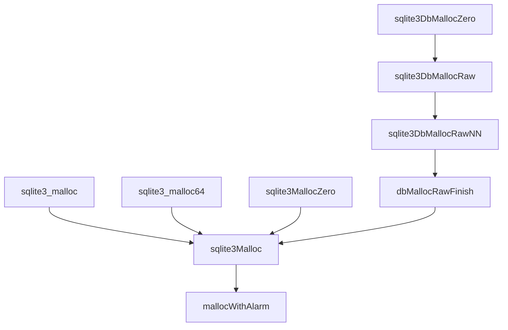
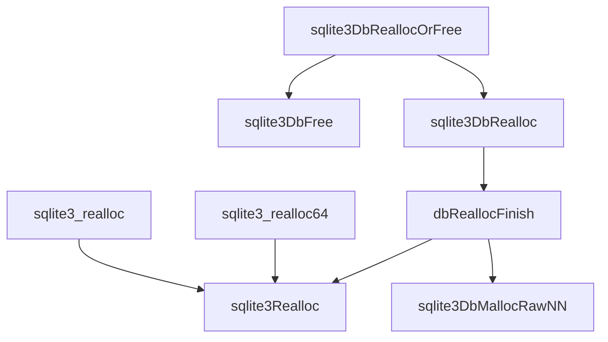
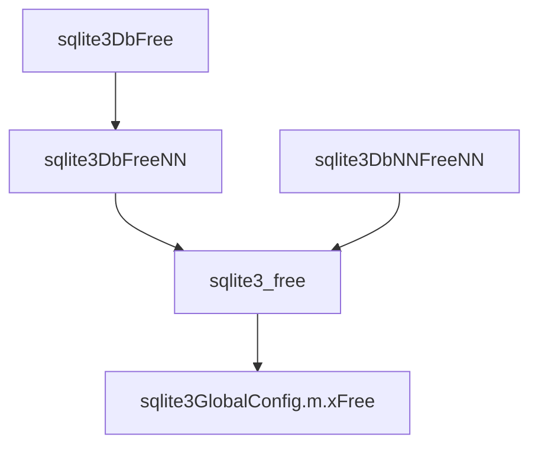

## 前记

SQLite3 中有比较复杂的内存管理,为 SQLite3 的稳定和高性能提供了保障.
主要参考资料:

1. [官方文档](https://www.sqlite.org/malloc.html)
2. malloc.c, mem2.c

**SQLite3 内存系统的特点**

1. 强大的内存分配失败处理机制
2. 无内存泄露
3. 内存使用限制
4. 可配置的内存分配器
5. 防止崩溃和内存碎片问题
6. 内存使用统计
7. 友好的内存调试功能
8. 尽量减少内存分配

**SQLite3 内存测试**

编译源代码时可以加入 `SQLITE_MEMDEBUG` 选项来开启内存调试.可以进行内存检查,检查的功能如下:

1. 边界检查
2. 使用了释放后的内存
3. 释放了不是使用 `malloc` 申请的内存
4. 未初始化的内存

**默认内存分配制**

SQLite3 默认情况下使用的 C 语言默认的 `malloc`,`free`,`realloc` 的这些内存管理接口,当然你也可以使用其他的内存管理,比如 `jemalloc`
.

**旁路内存分配器**

SQLite3 数据库会进行很多小的,短暂的内存分配,这种情况多见于 `sqlite3_prepare_v2` 函数在解析 SQL 语句的时候,在 `sqlite3_step` 执行 vdbe 编码的时候也会有比较小的内存分配.如果这些小的内存分配使用 `malloc` 和 `free` 的话,那么速度会非常的慢.

自 SQLITE3 3.6.1 版本开始,引入了旁路内存分配器(lookaside memory allocator) 减少内存分配负荷，在旁路分配器中，每个数据库连接都会预先分配一大块内存，然后将这一大块内存划分为固定大小的“插槽”，每个插槽的大小约为 100 到 1000 字节，这就是内存池。此后，与数据库连接相关在内存分配，如果不是太大，就会使用其中一个旁路池插槽。而不是调用通用分配器。较大的内存分配还是会使用通用内存分配器，当所有池插槽都已被使用时，会使用通用在内存分配器。

由于旁路内存分配的大小总是相同的，因此分配和取消的算法非常快速。无需合并相邻的空闲槽位，也无需搜索特定大小的槽位。每个数据库连接都会维护一个单链的未使用空闲列表。分配请求只需提取该列表在第一个元素。

**双尺寸 lookside**

从 SQLite 3.31 版本开始， lookside 支持两个内存池，每个内存池有不同大小的插槽。小插槽内存使用 128 字节的插槽，大插槽内存池使用 `SQLITE_DBCONFIG_LOOKASIDE` 指定的大小，默认为 1200 字节。

**内存状态**

默认情况下，SQLite 会对内存使用情况进行统计，这些统计数据有助于确定应用程序真正需要多少内存。这些统计数据还可用于高可靠性系统，以确定内存使用量是否接近或超过 `Robson` 证明的限制。从而确定内存分配子系统是否可能崩溃

**函数调用图**

内存申请



重新申请内存



内存释放




## 代码分析

### Mem0Global结构体

```c
static SQLITE_WSD struct Mem0Global {
  sqlite3_mutex *mutex;         /* Mutex to serialize access */
  sqlite3_int64 alarmThreshold; /* The soft heap limit */
  sqlite3_int64 hardLimit;      /* The hard upper bound on memory */

  /*
  ** True if heap is nearly "full" where "full" is defined by the
  ** sqlite3_soft_heap_limit() setting.
  */
  int nearlyFull;
} mem0 = { 0, SQLITE_MAX_MEMORY, SQLITE_MAX_MEMORY, 0 };
```

这个结构体中主要定义了四个变量:

1. `mutex` 用于分配和释放内存中进行加锁和解锁
2. `alarmThreshold` 内存分配的一个软限制,当已经分配的内存到了这个限制,就会设置 nearlyfull 的标志
3. `hardLimit` 内存分配硬限制,即 SQLite3 分配的内存无法超出这个限制.
4. 表示当前使用的内存是否已经快到达来软内存限制

同时我们这里也定一个了一个全局的 `mem0` 对象来统计整个应用程序的内存信息

### sqlite3_release_memory

```c
int sqlite3_release_memory(int n){
  UNUSED_PARAMETER(n);
  return 0;
#endif
}
```

这个函数的作用是释放那些当前没有在使用的内存,比如创建的临时表不再使用就可以进行释放,

### sqlite3MallocMutex

```c
/*
** Return the memory allocator mutex. sqlite3_status() needs it.
*/
sqlite3_mutex *sqlite3MallocMutex(void){
  return mem0.mutex;
}
```

这个函数返回了 `mem0` 的一个锁，这个锁在更新内存使用信心的时候，我们会用到

### sqlite3_soft_heap_limit64

```c
sqlite3_int64 sqlite3_soft_heap_limit64(sqlite3_int64 n){
  sqlite3_int64 priorLimit;
  sqlite3_int64 excess;
  sqlite3_int64 nUsed;
#ifndef SQLITE_OMIT_AUTOINIT
  int rc = sqlite3_initialize();
  if( rc ) return -1;
#endif
  sqlite3_mutex_enter(mem0.mutex);
  priorLimit = mem0.alarmThreshold;
  if( n<0 ){
    sqlite3_mutex_leave(mem0.mutex);
    return priorLimit;
  }
  if( mem0.hardLimit>0 && (n>mem0.hardLimit || n==0) ){
    n = mem0.hardLimit;
  }
  mem0.alarmThreshold = n;
  nUsed = sqlite3StatusValue(SQLITE_STATUS_MEMORY_USED);
  AtomicStore(&mem0.nearlyFull, n>0 && n<=nUsed);
  sqlite3_mutex_leave(mem0.mutex);
  excess = sqlite3_memory_used() - n;
  if( excess>0 ) sqlite3_release_memory((int)(excess & 0x7fffffff));
  return priorLimit;
}
void sqlite3_soft_heap_limit(int n){
  if( n<0 ) n = 0;
  sqlite3_soft_heap_limit64(n);
}
```

在这个函数中我们先使用 `sqlite3_initialize` 来进行系统初始化，一般情况下是已经初始化过的，所以这个会是一个 NO-OP 操作。

然后我们使用 `sqlite3_mutex_leave(mem0.mutex)` 来获取锁，保存一下之前的限制，如果 n 小于 0 则直接返回之前的限制，如果 `mem0` 存在一个硬限制的话，并且新的限制大于硬的限制，那么我们就将这个新的限制和原来的硬限制保持一致。

设置软内存限制，然后我们获取一下当前内存的使用量，如果使用量已经到达来软内存限制，则设置 `nearlyFull` 标志，这里使用了一个原子操作。

然后我们释放锁，如果当前使用的量已经超过来软内存限制，则开始释放一些不用的内存。

### sqlite3_hard_heap_limit64

设置硬内存限制，和设置软内存限制类似。

### sqlite3MallocInit

```c
int sqlite3MallocInit(void){
  int rc;
  if( sqlite3GlobalConfig.m.xMalloc==0 ){
    sqlite3MemSetDefault();
  }
  mem0.mutex = sqlite3MutexAlloc(SQLITE_MUTEX_STATIC_MEM);
  if( sqlite3GlobalConfig.pPage==0 || sqlite3GlobalConfig.szPage<512
      || sqlite3GlobalConfig.nPage<=0 ){
    sqlite3GlobalConfig.pPage = 0;
    sqlite3GlobalConfig.szPage = 0;
  }
  rc = sqlite3GlobalConfig.m.xInit(sqlite3GlobalConfig.m.pAppData);
  if( rc!=SQLITE_OK ) memset(&mem0, 0, sizeof(mem0));
  return rc;
}
```

这个函数的作用就是初始化内存分配系统：

1. 如果 `sqlite3GlobalConfig.m.xMalloc` 还没有设置，即还没有初始化，那么我们就使用默认的内存管理函数，即 `malloc`,`free`,`realloc`,`malloc_usable_size` 等等

2. 为 `mem0.mutex` 分配内存,为了后续实现加锁和解锁操作，这个 mutex 在 Linux 下实际上是 `pthread_mutex_t`.

3. 后续的 `nPage`,`szPage`,`nPage` 则是缓存页面的相关初始化，缓存也是需要使用到内存的

4. 最后使用 `xInit` 方法来初始化 `pAppData` 这一块内存，不过在默认在内存操作函数中，这个是一个空操作

### sqlite3MallocEnd

```c
void sqlite3MallocEnd(void){
  if( sqlite3GlobalConfig.m.xShutdown ){
    sqlite3GlobalConfig.m.xShutdown(sqlite3GlobalConfig.m.pAppData);
  }
  memset(&mem0, 0, sizeof(mem0));
}
```

析构 SQLite3 的内存系统。

### sqlite3HeapNearlyFull

```c
int sqlite3HeapNearlyFull(void){
  return AtomicLoad(&mem0.nearlyFull);
}
```

这里是一个原子操作，读取 `nearlyFull` 变量

### sqlite3_memory_used

```c
sqlite3_int64 sqlite3_memory_used(void){
  sqlite3_int64 res, mx;
  sqlite3_status64(SQLITE_STATUS_MEMORY_USED, &res, &mx, 0);
  return res;
}
```

通过 `sqlite3_status64` 来获取数据库系统当前使用的内存量

### sqlite3_memory_highwater

```c
sqlite3_int64 sqlite3_memory_highwater(int resetFlag){
  sqlite3_int64 res, mx;
  sqlite3_status64(SQLITE_STATUS_MEMORY_USED, &res, &mx, resetFlag);
  return mx;
}
```

通过 `sqlite3_status64` 函数来获取自程序运行以来使用的内存最高值

### sqlite3MallocAlarm

```c
static void sqlite3MallocAlarm(int nByte){
  if( mem0.alarmThreshold<=0 ) return;
  sqlite3_mutex_leave(mem0.mutex);
  sqlite3_release_memory(nByte);
  sqlite3_mutex_enter(mem0.mutex);
}
```

这个函数我们看到代码是关于内存释放的，但是为什么先释放锁然后又获取锁呢，是因为这个函数在调用之前一般已经获取来锁，如果再次获取锁就会形成死锁，而 `sqlite3_release_memory` 这个函数在使用 `SQLITE_ENABLE_MEMORY_MANAGEMENT` 宏的时候是一个空函数，所以也不需要加锁，如果使用了 `SQLITE_ENABLE_MEMORY_MANAGEMENT` 宏，那么在释放内存的时候，也还是会在 `sqlite3PcacheReleaseMemory` 函数内部进行加锁。

### mallocWithAlarm

```c
static void mallocWithAlarm(int n, void **pp){
  void *p;
  int nFull;
  nFull = sqlite3GlobalConfig.m.xRoundup(n);
  sqlite3StatusHighwater(SQLITE_STATUS_MALLOC_SIZE, n);
  if( mem0.alarmThreshold>0 ){
    sqlite3_int64 nUsed = sqlite3StatusValue(SQLITE_STATUS_MEMORY_USED);
    if( nUsed >= mem0.alarmThreshold - nFull ){
      AtomicStore(&mem0.nearlyFull, 1);
      sqlite3MallocAlarm(nFull);
      if( mem0.hardLimit ){
        nUsed = sqlite3StatusValue(SQLITE_STATUS_MEMORY_USED);
        if( nUsed >= mem0.hardLimit - nFull ){
          *pp = 0;
          return;
        }
      }
    }else{
      AtomicStore(&mem0.nearlyFull, 0);
    }
  }
  p = sqlite3GlobalConfig.m.xMalloc(nFull);
  if( p ){
    nFull = sqlite3MallocSize(p);
    sqlite3StatusUp(SQLITE_STATUS_MEMORY_USED, nFull);
    sqlite3StatusUp(SQLITE_STATUS_MALLOC_COUNT, 1);
  }
  *pp = p;
}
```

这个函数的作用就是分配一些内存，并且将分配好的内存加入统计信息，开始的时候使用 `xRoundup` 函数来计算一个 8 字节对其的长度，
然后计算一下这个要申请的内存长度是否已经超过了内存的软限制和硬限制，如果超出硬限制则直接返回空，否则就使用 `xMalloc` 函数来申请内存，并修改统计信息。这个函数只会在 `sqlite3Malloc` 中进行调用

### sqlite3Malloc

```c
void *sqlite3Malloc(u64 n){
  void *p;
  if( n==0 || n>SQLITE_MAX_ALLOCATION_SIZE ){
    p = 0;
  }else if( sqlite3GlobalConfig.bMemstat ){
    sqlite3_mutex_enter(mem0.mutex);
    mallocWithAlarm((int)n, &p);
    sqlite3_mutex_leave(mem0.mutex);
  }else{
    p = sqlite3GlobalConfig.m.xMalloc((int)n);
  }
  assert( EIGHT_BYTE_ALIGNMENT(p) );  /* IMP: R-11148-40995 */
  return p;
}
```

这个函数的主要作用就是分配内存了，调用来上面我们讲的 `mallocWithAlarm` 这个函数，函数一开始的时候加入来参数判断，判断要申请内存大小的合法性，然后检查内存统计信息是否可以使用，如果可用就使用`mallocWithAlarm` 来申请内存，否则直接使用 `xMalloc` 来申请内存。

### sqlite3_malloc

```c
void *sqlite3_malloc(int n){
#ifndef SQLITE_OMIT_AUTOINIT
  if( sqlite3_initialize() ) return 0;
#endif
  return n<=0 ? 0 : sqlite3Malloc(n);
}
```

这个函数首先会进行系统初始化，如果没有初始化，则返回空

### sqlite3_malloc64

同 `sqlite3_malloc`

### isLookaside

```c
 #ifndef SQLITE_OMIT_LOOKASIDE
static int isLookaside(sqlite3 *db, const void *p){
  return SQLITE_WITHIN(p, db->lookaside.pStart, db->lookaside.pTrueEnd);
}
#else
#define isLookaside(A,B) 0
#endif
```
检查给定的内存地址是否是一个旁路内存。使用数据库中 `lookasise` 的范围进行判断。

### sqlite3MallocSize

```c
int sqlite3MallocSize(const void *p){
  assert( sqlite3MemdebugHasType(p, MEMTYPE_HEAP) );
  return sqlite3GlobalConfig.m.xSize((void*)p);
}
```
这个函数返回指针 `p` 所指向内存的大小，实际上是通过调用系统函数 `malloc_usable_size `


###  sqlite3DbMallocSize
```c
int sqlite3DbMallocSize(sqlite3 *db, const void *p){
  assert( p!=0 );
#ifdef SQLITE_DEBUG
  if( db==0 ){
    assert( sqlite3MemdebugNoType(p, (u8)~MEMTYPE_HEAP) );
    assert( sqlite3MemdebugHasType(p, MEMTYPE_HEAP) );
  }else if( !isLookaside(db,p) ){
    assert( sqlite3MemdebugHasType(p, (MEMTYPE_LOOKASIDE|MEMTYPE_HEAP)) );
    assert( sqlite3MemdebugNoType(p, (u8)~(MEMTYPE_LOOKASIDE|MEMTYPE_HEAP)) );
  }
#endif
  if( db ){
    if( ((uptr)p)<(uptr)(db->lookaside.pTrueEnd) ){
#ifndef SQLITE_OMIT_TWOSIZE_LOOKASIDE
      if( ((uptr)p)>=(uptr)(db->lookaside.pMiddle) ){
        assert( sqlite3_mutex_held(db->mutex) );
        return LOOKASIDE_SMALL;
      }
#endif
      if( ((uptr)p)>=(uptr)(db->lookaside.pStart) ){
        assert( sqlite3_mutex_held(db->mutex) );
        return db->lookaside.szTrue;
      }
    }
  }
  return sqlite3GlobalConfig.m.xSize((void*)p);
}
```

这个函数多了一个参数就是 `sqlite3_db` 实际上还是来判断指针 `p` 执行内存的大小，先判断一下是不是旁路内存，如果是，则直接返回大小，如果不是，调用 `xSize` 返回实际的大小。

### sqlite3_free

```c
void sqlite3_free(void *p){
  if( p==0 ) return;  /* IMP: R-49053-54554 */
  assert( sqlite3MemdebugHasType(p, MEMTYPE_HEAP) );
  assert( sqlite3MemdebugNoType(p, (u8)~MEMTYPE_HEAP) );
  if( sqlite3GlobalConfig.bMemstat ){
    sqlite3_mutex_enter(mem0.mutex);
    sqlite3StatusDown(SQLITE_STATUS_MEMORY_USED, sqlite3MallocSize(p));
    sqlite3StatusDown(SQLITE_STATUS_MALLOC_COUNT, 1);
    sqlite3GlobalConfig.m.xFree(p);
    sqlite3_mutex_leave(mem0.mutex);
  }else{
    sqlite3GlobalConfig.m.xFree(p);
  }
}
```

释放使用 `sqlite3Malloc` 申请的内存，如果内存统计已经可以用，则更新统计信息，最后使用 `xFree` 来进行释放

### sqlite3DbFreeNN

```c
void sqlite3DbFreeNN(sqlite3 *db, void *p){
  assert( db==0 || sqlite3_mutex_held(db->mutex) );
  assert( p!=0 );
  if( db ){
    if( ((uptr)p)<(uptr)(db->lookaside.pEnd) ){
#ifndef SQLITE_OMIT_TWOSIZE_LOOKASIDE
      if( ((uptr)p)>=(uptr)(db->lookaside.pMiddle) ){
        LookasideSlot *pBuf = (LookasideSlot*)p;
        assert( db->pnBytesFreed==0 );
#ifdef SQLITE_DEBUG
        memset(p, 0xaa, LOOKASIDE_SMALL);  /* Trash freed content */
#endif
        pBuf->pNext = db->lookaside.pSmallFree;
        db->lookaside.pSmallFree = pBuf;
        return;
      }
#endif /* SQLITE_OMIT_TWOSIZE_LOOKASIDE */
      if( ((uptr)p)>=(uptr)(db->lookaside.pStart) ){
        LookasideSlot *pBuf = (LookasideSlot*)p;
        assert( db->pnBytesFreed==0 );
#ifdef SQLITE_DEBUG
        memset(p, 0xaa, db->lookaside.szTrue);  /* Trash freed content */
#endif
        pBuf->pNext = db->lookaside.pFree;
        db->lookaside.pFree = pBuf;
        return;
      }
    }
    if( db->pnBytesFreed ){
      measureAllocationSize(db, p);
      return;
    }
  }
  assert( sqlite3MemdebugHasType(p, (MEMTYPE_LOOKASIDE|MEMTYPE_HEAP)) );
  assert( sqlite3MemdebugNoType(p, (u8)~(MEMTYPE_LOOKASIDE|MEMTYPE_HEAP)) );
  assert( db!=0 || sqlite3MemdebugNoType(p, MEMTYPE_LOOKASIDE) );
  sqlite3MemdebugSetType(p, MEMTYPE_HEAP);
  sqlite3_free(p);
}
```

释放内存，这个函数的名字有一个特点，带有一个 `NN` 表示 NOT NULL，即这个函数要释放的指针不能为空，
这个函数的主要流程为检查是否是旁路内存，如果是的话，直接标记为空，返回，如果不是的话，直接使用 `sqlite3_free` 来释放内存。

### sqlite3DbNNFreeNN

```c 
void sqlite3DbNNFreeNN(sqlite3 *db, void *p){
  assert( db!=0 );
  assert( sqlite3_mutex_held(db->mutex) );
  assert( p!=0 );
  if( ((uptr)p)<(uptr)(db->lookaside.pEnd) ){
#ifndef SQLITE_OMIT_TWOSIZE_LOOKASIDE
    if( ((uptr)p)>=(uptr)(db->lookaside.pMiddle) ){
      LookasideSlot *pBuf = (LookasideSlot*)p;
      assert( db->pnBytesFreed==0 );
#ifdef SQLITE_DEBUG
      memset(p, 0xaa, LOOKASIDE_SMALL);  /* Trash freed content */
#endif
      pBuf->pNext = db->lookaside.pSmallFree;
      db->lookaside.pSmallFree = pBuf;
      return;
    }
#endif /* SQLITE_OMIT_TWOSIZE_LOOKASIDE */
    if( ((uptr)p)>=(uptr)(db->lookaside.pStart) ){
      LookasideSlot *pBuf = (LookasideSlot*)p;
      assert( db->pnBytesFreed==0 );
#ifdef SQLITE_DEBUG
      memset(p, 0xaa, db->lookaside.szTrue);  /* Trash freed content */
#endif
      pBuf->pNext = db->lookaside.pFree;
      db->lookaside.pFree = pBuf;
      return;
    }
  }
  if( db->pnBytesFreed ){
    measureAllocationSize(db, p);
    return;
  }
  assert( sqlite3MemdebugHasType(p, (MEMTYPE_LOOKASIDE|MEMTYPE_HEAP)) );
  assert( sqlite3MemdebugNoType(p, (u8)~(MEMTYPE_LOOKASIDE|MEMTYPE_HEAP)) );
  sqlite3MemdebugSetType(p, MEMTYPE_HEAP);
  sqlite3_free(p);
}
```

这个函数的功能和 `sqlite3DbFreeNN` 类似，但是有一个特点就是带有两个 `NN` 表示在这个函数中 `sqlite3` 和 指针 `p` 都不能为空。


### sqlite3Realloc

```c
void *sqlite3Realloc(void *pOld, u64 nBytes){
  int nOld, nNew, nDiff;
  void *pNew;
  assert( sqlite3MemdebugHasType(pOld, MEMTYPE_HEAP) );
  assert( sqlite3MemdebugNoType(pOld, (u8)~MEMTYPE_HEAP) );
  if( pOld==0 ){
    return sqlite3Malloc(nBytes); /* IMP: R-04300-56712 */
  }
  if( nBytes==0 ){
    sqlite3_free(pOld); /* IMP: R-26507-47431 */
    return 0;
  }
  if( nBytes>=0x7fffff00 ){
    /* The 0x7ffff00 limit term is explained in comments on sqlite3Malloc() */
    return 0;
  }
  nOld = sqlite3MallocSize(pOld);
  /* IMPLEMENTATION-OF: R-46199-30249 SQLite guarantees that the second
  ** argument to xRealloc is always a value returned by a prior call to
  ** xRoundup. */
  nNew = sqlite3GlobalConfig.m.xRoundup((int)nBytes);
  if( nOld==nNew ){
    pNew = pOld;
  }else if( sqlite3GlobalConfig.bMemstat ){
    sqlite3_int64 nUsed;
    sqlite3_mutex_enter(mem0.mutex);
    sqlite3StatusHighwater(SQLITE_STATUS_MALLOC_SIZE, (int)nBytes);
    nDiff = nNew - nOld;
    if( nDiff>0 && (nUsed = sqlite3StatusValue(SQLITE_STATUS_MEMORY_USED)) >= 
          mem0.alarmThreshold-nDiff ){
      sqlite3MallocAlarm(nDiff);
      if( mem0.hardLimit>0 && nUsed >= mem0.hardLimit - nDiff ){
        sqlite3_mutex_leave(mem0.mutex);
        return 0;
      }
    }
    pNew = sqlite3GlobalConfig.m.xRealloc(pOld, nNew);
#ifdef SQLITE_ENABLE_MEMORY_MANAGEMENT
    if( pNew==0 && mem0.alarmThreshold>0 ){
      sqlite3MallocAlarm((int)nBytes);
      pNew = sqlite3GlobalConfig.m.xRealloc(pOld, nNew);
    }
#endif
    if( pNew ){
      nNew = sqlite3MallocSize(pNew);
      sqlite3StatusUp(SQLITE_STATUS_MEMORY_USED, nNew-nOld);
    }
    sqlite3_mutex_leave(mem0.mutex);
  }else{
    pNew = sqlite3GlobalConfig.m.xRealloc(pOld, nNew);
  }
  assert( EIGHT_BYTE_ALIGNMENT(pNew) ); /* IMP: R-11148-40995 */
  return pNew;
}
```

这个函数的功能是用来修改一个已经分配内存的大小，这个还实现来如果原来是一个空指针，那么直接分配一个新内存。

如果新内存和老内存的大小是一致的话，直接返回，什么也不做。

然后我们就调用 `xRealloc` 来重新分配内存。


### sqlite3DbMallocZero

```c
void *sqlite3DbMallocZero(sqlite3 *db, u64 n){
  void *p;
  testcase( db==0 );
  p = sqlite3DbMallocRaw(db, n);
  if( p ) memset(p, 0, (size_t)n);
  return p;
}
```
和 `sqlite3_malloc` 类似，申请一个内存，供系统内部使用，其余 `sqlite3Db*` 系列函数与此前讲述的函数功能大致相同。

### sqlite3DbStrNDup

```c
char *sqlite3DbStrNDup(sqlite3 *db, const char *z, u64 n){
  char *zNew;
  assert( db!=0 );
  assert( z!=0 || n==0 );
  assert( (n&0x7fffffff)==n );
  zNew = z ? sqlite3DbMallocRawNN(db, n+1) : 0;
  if( zNew ){
    memcpy(zNew, z, (size_t)n);
    zNew[n] = 0;
  }
  return zNew;
}
```

这个函数的作用是申请一份内存，并将字符串复制到其中。

### sqlite3DbSpanDup

```c
char *sqlite3DbSpanDup(sqlite3 *db, const char *zStart, const char *zEnd){
  int n;
  while( sqlite3Isspace(zStart[0]) ) zStart++;
  n = (int)(zEnd - zStart);
  while( ALWAYS(n>0) && sqlite3Isspace(zStart[n-1]) ) n--;
  return sqlite3DbStrNDup(db, zStart, n);
}
```
这个函数的所有是复制位于 `zStart`,'zEnd' 之间的字符串，并删除前后的空格。


## 后记

看完 SQLite3 的内存分配，我们应该对整个数据库系统在内存管理有一个初步的了解。如果内存操作的参数中含有 `sqlite3`，那么这个内存操作可能会涉及到旁路内存，如果没有的话，那就是直接从系统中分配内存。同时有些内存申请后会立即使用，不需要重置内存，有些就需要使用 0 去初始化内存。如果函数名字带有`Finish` 字样，那么这个函数的主要逻辑就是如果从旁路内存申请失败的话，会从堆上申请内存。 


